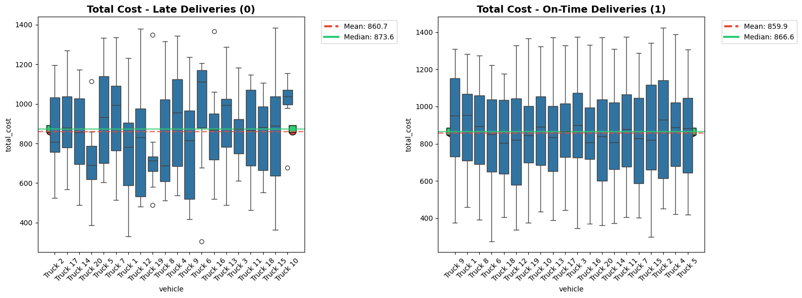
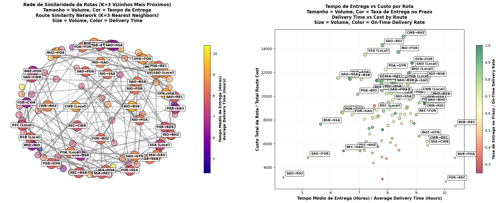

# Delivery Analysis | Análise de entregas

**English:**
👉 The complete analysis with results, final remarks and recommendations is available here: [delivery_data_analysis.ipynb](delivery_data_analysis.ipynb) 

**Português:**
👉 A análise completa com resultados, considerações finais e recomendações está disponível aqui: [delivery_data_analysis.ipynb](delivery_data_analysis.ipynb)  

## 📊 Delivery Analysis Preview | Visualização Prévia da análise de entregas

## 📊 Data Overview | Visão Geral dos Dados
**English:** This project analyzes comprehensive delivery data data including:
- **Delivery information**: delivery id, date, origin, destination and vehicle
- **Operational information**: distance (in km), delivery time (in hour), on time (if delivery was late or on time), weather 
- **Cost information**: fuel, toll, maintenance and total cost

**Português:** Este projeto analisa dados abrangentes de entregas, incluindo:
- **Informações de entrega**: id da entrega, data, origem, destino e veículo
- **Informações operacionais**: distância (em km), tempo de entrega (em horas), pontualidade (se a entrega atrasada ou no prazo), clima
- **Informações de custo**: combustível, pedágio, manuntenção e custo total

## ✨ Key Features | Principais Funcionalidades
- **Similarity delivery route analysis** | **Análise de similaridade das rotas de entrega**
- **On time delivery analysis** | **Análise da pontualidade das entregas**
- **Vehicle performance analysis** | **Análise da performance dos veículos**
- **Problematic vs optimized routes** | **Rotas problemáticas vs rotas otimizadas**
- **Detailed cost analysis** | **Análise detalhada de custo**

## 📁 Files Included | Arquivos Incluídos
- `delivery_analysis.png` - Screenshot of one of the results | Captura de tela de um dos resultados
- `delivery_analysis2.png` - Screenshot of one of the results | Captura de tela de um dos resultados
- `delivery_data.csv` -  Data file | Arquivo de dados
- `delivery_data_analysis.ipynb` - Jupyter notebook with complete analysis | Jupyter notebook com análise completa 

